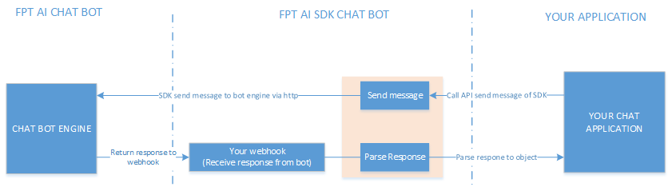

# FPT AI CHAT BOT SDK  
## Tổng quan  
Chat bot SDK được sử dụng để gửi tin nhắn tới chat bot engine và chuyển đổi phản hồi từ chat bot.  


##Cài đặt  
- Java  
Sử dụng thư viện fptai-chatbot-sdk-java.jar
- Python 
```
pip install -i https://test.pypi.org/simple/ fptai-chatbot-sdk
```

## Sử dụng  
### Java  
Khởi tạo bot manager  
```java
BotManager bmn = new BotManager(bot_host, bot_token, channel);
```
Tạo tin nhắn và gửi tới bot
```java
bmn.buildTextMessage(content).sendMessage(sender_id)
```
Parse Response tại webhook
```java
BotManager bmn = new BotManager();
BotResponse bot_res_obj = bmn.parseResponse(bot_response);
```
Xem thêm tại fptai-sdk-java-example

### Python
Khởi tạo bot manager
```python
bot_manager = BotManager(bot_token, channel, bot_host)
```
Tạo tin nhắn và gửi tới bot
```python
bot_manager.build_text_message(content).send_message(sender_id)
```
Parse Response tại webhook
```python
bot_response_obj = BotManager.parse_response(bot_response)
```